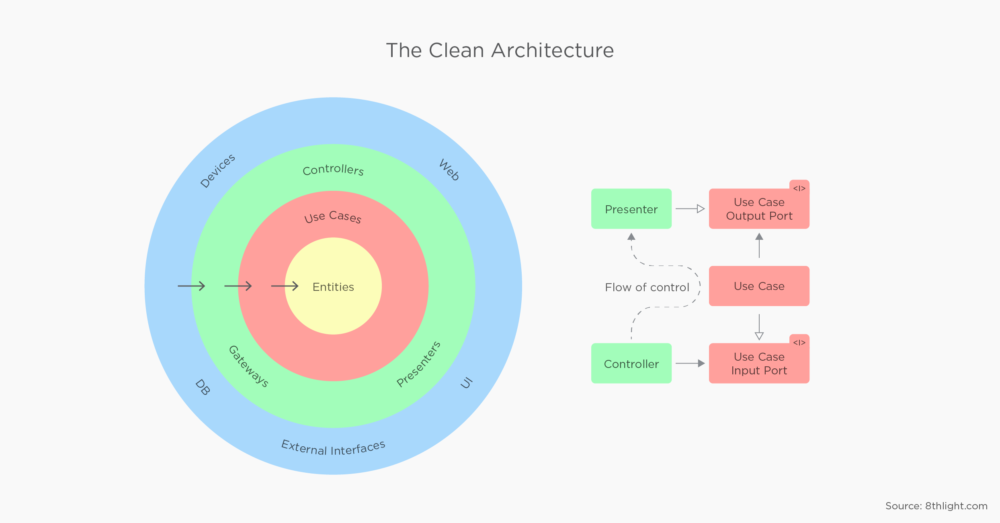
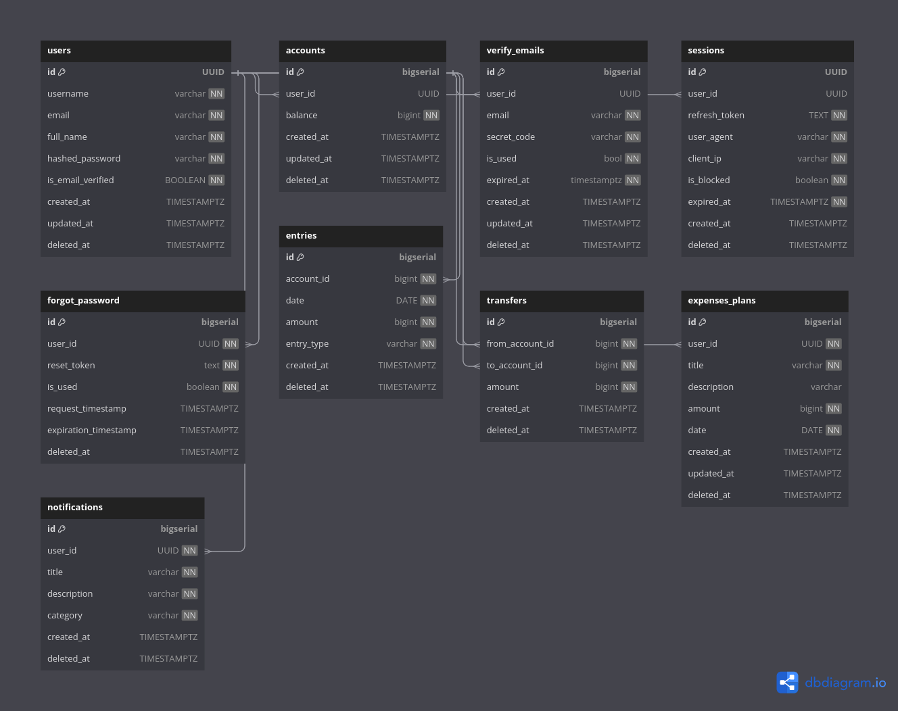

<h1 align="center">Welcome Simple Bank API GO Clean Architecture</h1>
<p>
  
  <a href="https://goreportcard.com/badge/github.com/benebobaa/amikom-bri-api" target="_blank">
    
  </a>
  <a href="#" target="_blank">
    
  </a>

</p>

- This project is a user-friendly solution for basic banking tasks, built using the Go programming language and adhering to the Clean Architecture principles. It encompasses essential features such as account creation, listing, balance checking, account transfers, and transaction history tracking. Additionally, it incorporates advanced functionalities like user registration, email verification, authentication with JWT (JSON Web Token) using access and refresh tokens, password recovery with email-based reset links, email notifications for transfers, and the ability to create and export transaction and expense history to PDF.


## Architecture
-  I have crafted this architecture inspired by Uncle Bob's Clean Architecture, the Golang course from Programmer Zaman Now, Harisenin's Proclass Golang, GSabadini's Repository, and also my own Created Go Native Clean Architecture. I have customized it to fit my specific needs. Source above this:
- [Amikom Pedia API](https://github.com/benebobaa/amikom-pedia-api).
- [GSabadini Clean Arch](https://github.com/GSabadini/go-clean-architecture).
- [Progammer Zaman Now(Eko Khannedy) Clean Arch](https://github.com/khannedy/golang-clean-architecture).



## ERD Diagram Database
### Source : [diagram.io erd](https://dbdiagram.io/d/65ccfe1dac844320ae26a809)


## Requirements/dependencies
- Docker


## Getting Started Run Locally

- Pull Postgres Images and Run Container with Docker

```sh
make postgres
```

- Run Database Migrations

```sh
make migrateup
```

- Run Go Server API

```sh
go run main.go
```


## API Request

### Currently Published Example Endpoints
### Base URL: `https://go.amikompedia.xyz`

| Endpoint                                 | HTTP Method           | Description       |
|------------------------------------------| :---------------------: | :-----------------: |
| `api/v1/accounts`                        | `POST`                | `Create accounts` |
| `api/v1/accounts`                        | `GET`                 | `List accounts`   |
| `api/v1/accounts/{{account_id}}/balance` | `GET`                |    `Find balance account` |
| `api/v1/transfers`                       | `POST`                | `Create transfer` |
| `api/v1/transfers`                       | `GET`                 | `List transfers`  |
| `api/v1/health`                          | `GET`                 | `Health check`  |

### For More Detail API Documentation Please Import `apispec.json` to Postman

